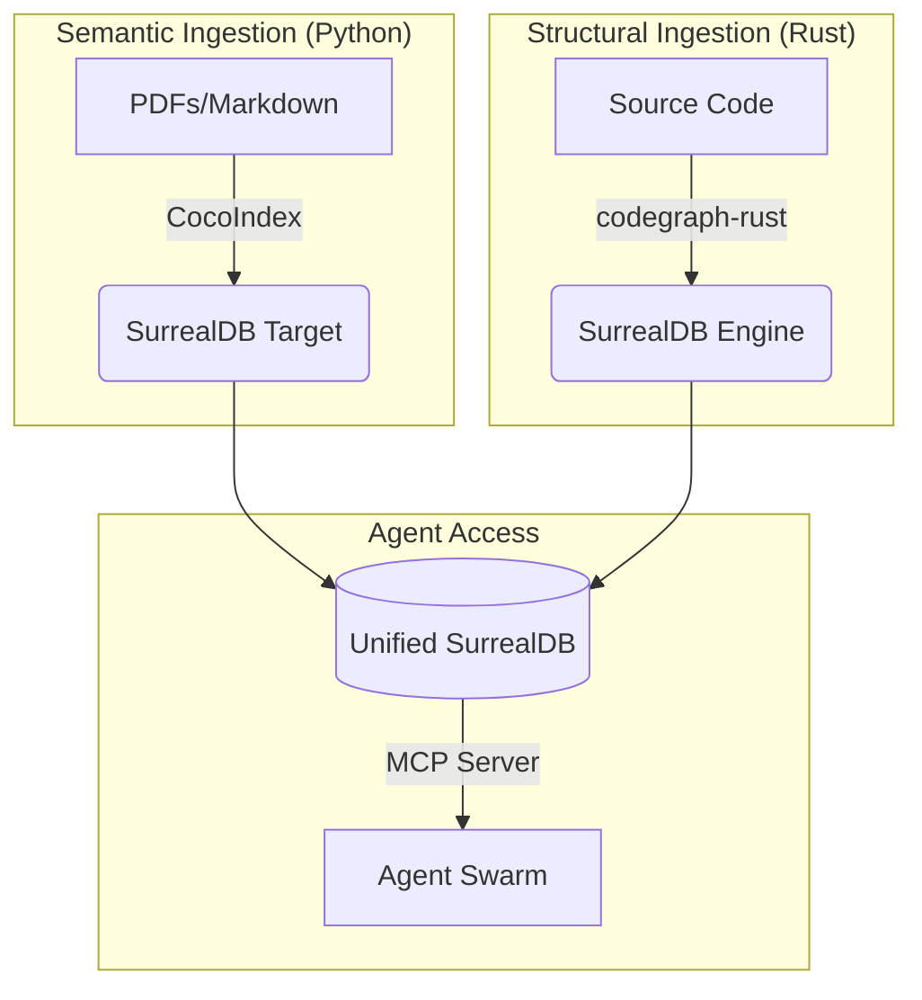

# Unified Knowledge Graph Integration Guide for Agent Swarms

- **Version:** 1.0
- **Target System:** Agent-Swarm / Agent-Harness
- **Core Technologies:** CocoIndex (Semantic), CodeGraph (Structural), SurrealDB (Unified Storage)

---

## 1. Executive Summary

This document outlines the architecture for a **Unified Knowledge Graph** that serves as the shared long-term memory for a swarm of coding agents. By integrating CocoIndex (unstructured data/documentation) and CodeGraph (code structure/AST) into a single SurrealDB instance, we allow agents to perform complex reasoning tasks that require bridging the gap between intent (docs) and implementation (code).

**The "Holy Grail" Query:**

> "Find the Rust function responsible for `voltage_readout` (Structural) and retrieve the vendor PDF section that describes its calibration formula (Semantic)."

---

## 2. Architecture Overview

The system follows a **"Hub-and-Spoke"** data topology where SurrealDB is the central hub.



### 2.1. Why SurrealDB?

| Property | Benefit |
|----------|---------|
| **Multi-Model** | Handles the strict graph structure of code (AST) alongside the flexible document structure of parsed PDFs |
| **Vector Native** | Stores embedding vectors directly on nodes, allowing hybrid search (Keyword + Vector + Graph Traversal) in a single query |
| **Polyglot** | Bridges the Python ecosystem of CocoIndex and the Rust ecosystem of codegraph-rust |

---

## 3. Data Schema & Unification Strategy

To allow agents to traverse between documentation and code, we must define a shared schema.

### 3.1. The Code Graph (Structural)

Derived from `jakedismo/codegraph-rust`.

- **Nodes:** `file`, `function`, `struct`, `trait`, `module`
- **Edges:** `calls`, `defines`, `imports`, `implements`

### 3.2. The Doc Graph (Semantic)

Derived from CocoIndex.

- **Nodes:** `document`, `chunk`
- **Edges:** `contains` (Document → Chunk), `references` (Chunk → Code Node)

### 3.3. The "Bridge" Edge

This is the critical component agents must maintain.

- **Edge Type:** `mentions` or `documents`
- **Logic:** Created when a chunk embedding is semantically similar to a function embedding, or when a regex matches a code symbol in the text.

---

## 4. Implementation Guide for Agents

Agents reading this guide should follow this implementation plan (Beads Epic format).

### Phase 1: SurrealDB Infrastructure

**Goal:** Deploy a central SurrealDB instance accessible by both Python and Rust processes.

```bash
surreal start --log trace --user root --pass root file://knowledge_graph.db
```

### Phase 2: CocoIndex "SurrealTarget" (Python)

CocoIndex does not natively support SurrealDB. Agents must implement a custom `Target`.

**Reference:** `cocoindex-io/cocoindex/.../python/cocoindex/typing.py` (Target Interface)

```python
# src/targets/surreal_target.py
from typing import Any, Dict, List
from cocoindex.typing import Target
from surrealdb import Surreal

class SurrealDBTarget(Target):
    def __init__(self, url: str, namespace: str, database: str):
        self.url = url
        self.ns = namespace
        self.db = database

    def batch_write(self, records: List[Dict[str, Any]]):
        async def _write():
            async with Surreal(self.url) as db:
                await db.use(self.ns, self.db)
                for record in records:
                    # Create a 'chunk' node.
                    # Use deterministic IDs if possible for idempotency.
                    content = record.get("text", "")
                    vector = record.get("embedding", [])

                    # SurrealQL injection safe query
                    await db.query("""
                        CREATE chunk CONTENT {
                            content: $content,
                            embedding: $vector,
                            source: $metadata.source,
                            page: $metadata.page
                        };
                    """, {
                        "content": content,
                        "vector": vector,
                        "metadata": record.get("metadata", {})
                    })

        import asyncio
        asyncio.run(_write())
```

### Phase 3: CodeGraph Ingestion (Rust)

Agents must configure `codegraph-rust` to output to the shared SurrealDB.

- **Reference:** `jakedismo/codegraph-rust/.../crates/codegraph-graph/src/surrealdb_storage.rs`
- **Action:** Verify codegraph-rust supports the remote SurrealDB instance (it defaults to embedded RocksDB or local file).
- **Configuration:** Create a `codegraph.toml` that points to `ws://localhost:8000`.

### Phase 4: The Unification Processor

Agents must create a post-processing script (Python or Rust) that creates the **"Bridge Edges."**

**Logic:**

```sql
-- SurrealQL: Link Docs to Code based on fuzzy symbol matching
-- This runs inside the DB or via a client script
LET $docs = (SELECT * FROM chunk);
FOR $doc IN $docs {
    -- Extract potential function names (e.g., snake_case words)
    LET $mentions = regex::extract($doc.content, /[a-z0-9_]+_read/);

    FOR $symbol IN $mentions {
        -- Find the code node
        LET $code_node = (SELECT id FROM function WHERE name = $symbol LIMIT 1);

        -- Create the edge
        IF $code_node {
            RELATE $doc->documents->$code_node;
        };
    };
};
```

### Phase 5: MCP Tool Exposure

Agents must update the MCP server to expose this unified graph.

**Reference:** `vitali87/code-graph-rag/.../codebase_rag/mcp/server.py`

**New Tool:** `search_unified_knowledge(query: str)`

**Implementation:**

1. Embed query
2. Perform Vector Search on `chunk` nodes (Documentation)
3. Traverse `->documents->` edge to find related `function` nodes
4. Perform Vector Search on `function` nodes (Code)
5. Return a combined context of "How it works (Docs)" + "How it's written (Code)"

---

## 5. Citations & Resources

- **CocoIndex Target Interface:** `cocoindex-io/cocoindex/.../python/cocoindex/typing.py`
- **CodeGraph Schema:** `jakedismo/codegraph-rust/.../schema/codegraph.surql`
- **MCP Server Base:** `vitali87/code-graph-rag/.../codebase_rag/mcp/server.py`
